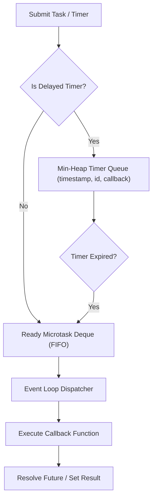

# genpark-async-event-loop-reactor-scheduler-skill

Agent Skill implementing a **Cooperative Asynchronous Event Loop & Reactor Scheduler** with dual queues (ready microtask deque + min-heap timer priority queue), Futures, and completion callbacks.

## Architectural Overview

